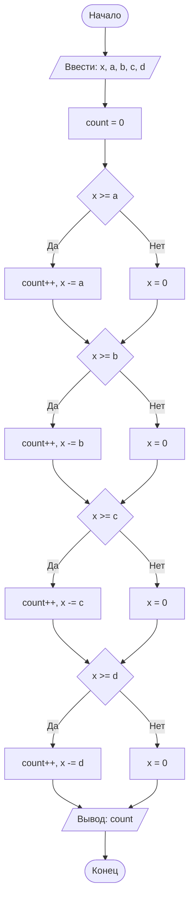

## Отчет по лабораторной работе № 1

#### № группы: `ПМ-2602`

#### Выполнил: `Скорлупкин Тимофей Дмитриевич`

#### Вариант: `20`

### Содержание:

- [Постановка задачи](#1-постановка-задачи)
- [Входные и выходные данные](#2-входные-и-выходные-данные)
- [Выбор структуры данных](#3-выбор-структуры-данных)
- [Алгоритм](#4-алгоритм)
- [Программа](#5-программа)
- [Анализ правильности решения](#6-анализ-правильности-решения)

### 1. Постановка задачи

> 4 покупателя стоят в очереди за бананами. Они планируют купить A, B, C, D килограмм бананов соответственно порядку в очереди (или все оставшиеся, если к моменту обслуживания покупателя в магазине остаётся меньше бананов, чем планирует купить покупатель). Изначально в магазине имеется X кг бананов. Сколько покупателей смогут купить бананы, которые они планируют?

Данную задачу можно разбить на 4 подзадачи - по одной на каждого покупателя. Покупатели обслуживаются строго по очереди, поэтому для каждого из них нужно:

1. Проверить, хватает ли в магазине бананов на его план.
2. Если бананов хватает - засчитать покупателя и вычесть его план из остатка (кол-ва кг бананов).
3. Если не хватает - покупатель забирает все оставшиеся бананы, а значит в магазине становится 0 кг, и все следующие покупатели гарантированно остаются ни с чем.

Тогда, для каждого покупателя рассматривается 2 случая:

1. Бананов хватает (`X >= план`) - покупатель доволен, остаток уменьшается.
2. Бананов не хватает (`X < план`) - покупатель забирает остаток, в магазине 0.

### 2. Входные и выходные данные

#### Данные на вход

На вход программа должна получать 5 натуральных чисел: изначальное количество бананов `X` и планы по закупке четырех покупателей `A`, `B`, `C`, `D`.

|                        | Тип               | min значение | max значение |
|------------------------|-------------------|--------------|--------------|
| X (бананов в магазине) | Натуральное число | 1            | -            |
| A (план 1-го)          | Натуральное число | 1            | -            |
| B (план 2-го)          | Натуральное число | 1            | -            |
| C (план 3-го)          | Натуральное число | 1            | -            |
| D (план 4-го)          | Натуральное число | 1            | -            |

#### Данные на выход

Программа выводит единственное целое неотрицательное число от 0 до 4 - количество покупателей, которые смогли купить запланированное количество бананов.

|                               | Тип                         | min значение | max значение |
|-------------------------------|-----------------------------|--------------|--------------|
| Количество довольных (count)  | Целое неотрицательное число | 0            | 4            |

### 3. Выбор структуры данных

Программа получает 5 натуральных чисел, для их хранения достаточно 5 переменных типа `int`. Для подсчета количества довольных покупателей нужна еще одна переменная `count` типа `int`, изначально равная 0.

|                        | название переменной | Тип (в Java) |
|------------------------|---------------------|--------------|
| X (бананов в магазине) | `x`                 | `int`        |
| A (план 1-го)          | `a`                 | `int`        |
| B (план 2-го)          | `b`                 | `int`        |
| C (план 3-го)          | `c`                 | `int`        |
| D (план 4-го)          | `d`                 | `int`        |
| Счетчик довольных      | `count`             | `int`        |

Отдельная переменная для результата не нужна - результат хранится в `count`.

### 4. Алгоритм

#### Алгоритм выполнения программы:

1. **Ввод данных:**
   Программа считывает 5 натуральных чисел: `x`, `a`, `b`, `c`, `d`.

2. **Инициализация счетчика:**
   Переменная `count` устанавливается в 0.

3. **Проверка первого покупателя:**
   Если `x >= a` - увеличиваем `count` на 1 и вычитаем `a` из `x`. Иначе - обнуляем `x` (покупатель забирает весь остаток).

4. **Проверка второго покупателя:**
   Аналогично для `b`.

5. **Проверка третьего покупателя:**
   Аналогично для `c`.

6. **Проверка четвертого покупателя:**
   Аналогично для `d`.

7. **Вывод результата:**
   На экран выводится значение `count`.

#### Блок-схема



### 5. Программа

```java
// импорт нужных для функционирования программы библиотек
import java.io.PrintStream;
import java.util.Scanner;

public class Main {
    public static void main(String[] args) {
        // объявляем объект класса Scanner, чтобы получать ввод с клавиатуры
        Scanner in = new Scanner(System.in);
        // объявляем объект класса PrintStream, чтобы выводить текст в консоль
        PrintStream out = System.out;

        // инициализируем переменную x - кол-во бананов в кг. в магазине
        int x = in.nextInt();

        // инициализируем переменные a, b, c, d - нужное кол-во бананов для каждого покупателя
        int a = in.nextInt();
        int b = in.nextInt();
        int c = in.nextInt();
        int d = in.nextInt();

        // инициализируем переменную count - счет довольных покупателей, получивших свои бананы :)
        int count = 0;

        /* после этого, начинаем проверку по очереди...
        если бананы получил первый желающий, то проверяем следующего и прибавляем к счетчику покупателей
        одного довольного клиента. если кому-либо не хватило бананов, счет обрывается, и программа
        выводит кол-во покупателей с нужным кол-вом бананов
        */
        if (x >= a) {
            count++;
            x -= a;
        } else {
            x = 0;
        }
        if (x >= b) {
            count++;
            x -= b;
        } else {
            x = 0;
        }
        if (x >= c) {
            count++;
            x -= c;
        } else {
            x = 0;
        }
        if (x >= d) {
            count++;
            x -= d;
        } else {
            x = 0;
        }

        // вызываем вывод переменной, хранящей в себе информацию о покупателях с нужным кол-вом бананов
        out.println(count);
    }
}
```

### 6. Анализ правильности решения

Программа работает корректно на всем множестве решений с учетом ограничений.

1. Тест: всем покупателям хватает бананов
    - **Input:**
        ```
        100 1 2 3 4
        ```
    - **Output:**
        ```
        4
        ```

2. Тест: бананов не хватает уже первому покупателю
    - **Input:**
        ```
        5 10 1 1 1
        ```
    - **Output:**
        ```
        0
        ```
    - Пояснение: первый покупатель хотел 10 кг, но в магазине только 5 - он забирает все, и из-за этого остальным ничего не остается.

3. Тест: бананов хватает первым двум, третьему - нет
    - **Input:**
        ```
        10 3 4 5 1
        ```
    - **Output:**
        ```
        2
        ```
    - Пояснение: 1-й взял 3 кг (остаток 7), 2-й взял 4 кг (остаток 3), 3-й хотел 5 кг - не хватило, забирает все, остаток 0. 4-й остается ни с чем. Довольных покупателей - 2.

4. Тест: бананов хватает ровно на первых трех, четвертому - нет
    - **Input:**
        ```
        6 1 2 3 1
        ```
    - **Output:**
        ```
        3
        ```

5. Тест: граничный случай, бананов ровно на всех
    - **Input:**
        ```
        10 1 2 3 4
        ```
    - **Output:**
        ```
        4
        ```